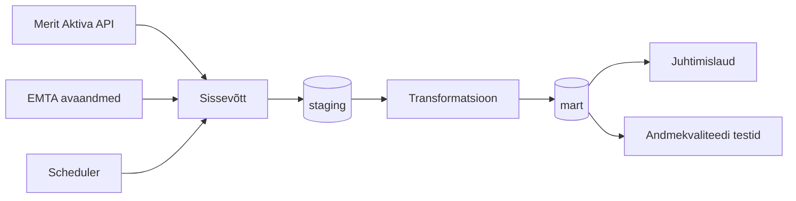

# Arhitektuur

## Äriküsimus

Ettevõtja juhtimislaud, mis võimaldab jälgida ettevõtte finantsseisu reaalajas ning võrrelda seda konkurentidega.

## Mõõdikud

1. Vaba raha - pangakontode saldod + kassa - tasumist vajavad arved
2. Viimase 30 päeva tulud ja kulud
3. Rahaline puhver (Runway) - vaba raha / keskmine kulu päeva kohta
4. Käibemaksu kuupõhine arvestus - müügikäibemaks - sisendkäibemaks = tasumisele kuuluv summa
5. Viimased tehingud - 5 viimast tehingut
6. Konkurentide võrdlustabel - käive, kasum, töötajad, käive €/töötajate arv, MTA võlg

## Andmeallikad

| Allikas | Tüüp | Ajas muutuv? | Roll |
|---------|------|--------------|------|
| Merit Aktiva API | API | Jah | Töölaua andmete kuvamiseks |
| EMTA avaandmed | CSV | Jah, uueneb iga kvartalile järgneva kuu 10. kuupäeval | Konkurentide info kuvamiseks|

## Andmevoog

## Andmebaasi kihid

| Kiht | Roll |
|------|------|
| `staging` | Hoiab allikate andmeid töötlemata kujul. |
| `mart` | Hoiab transformeeritud ja ärilogikat sisaldavaid tabeleid. |

## Tööjaotus

| Roll | Vastutus | Täitja |
|------|----------|--------|
| Andmeallika omanik | Kirjutab sissevõtu loogika, hoiab API-t töös | Veli |
| Transformatsioonide omanik | Kirjutab mart kihi mudelid ja mõõdikute arvutuse | Steven |
| Kvaliteedi omanik | Kirjutab testid ja vaatab läbi ebaõnnestunud kontrollid | Karin |
| Näidikulaua omanik | Ehitab näidikulaua ja seob selle äriküsimusega | Kristel |

## Riskid

| Risk | Mõju | Maandus |
|------|------|---------|
| Merit Aktiva API muutub või ei vasta | API-t ja/või endpointe uuendatakse, breaking change  | Versioneeritud API kasutamine, Meriti changelogi jälgimine, vana cache näitamine, kui API ei vasta |
| EMTA avaandmete formaat muutub etteteatamata | CSV veerud, kodeering, eraldajad, kuupäevaformaadid muutuvad | Schema validatsioon staging'us, alert kui veerud kaovad/lisanduvad, varundatud koopiad vanadest failidest |
| EMTA andmete värskendamise sagedus on madalam kui kasutaja ootab | Kui kasutaja näeb "reaalajas" dashboardi ja eeldab, et konkurendi võlg ilmub kohe | Näidata konkurentide võrdlustabeli juures viimase värskendamise aega|
| Scheduler ebaõnnestub | Cron job jookseb, aga andmeid ei tule | freshness-testid mart'is (alert kui max(updated_at) > 24h), monitooring (Sentry, Grafana) |

## Privaatsus ja turve

Staging'us võib säilitada isikuandmed, mart'is hoida võimalikult agregeerituna, arenduskeskkonnas pseudonümiseerida, logides eemaldada. Andmebaasi paroolid peavad tulema .env failist. Tundlikud äriandmed (mitte isikuandmed, aga sama kaitse vajavad): pangakontode saldod ja IBAN-id; käive, kasum, marginaalid. Juhtimislaua enda tekitatud andmed: kasutajakontod (e-post, parool, sessioonitokenid, IP-aadressid, sisselogimiste logi).
