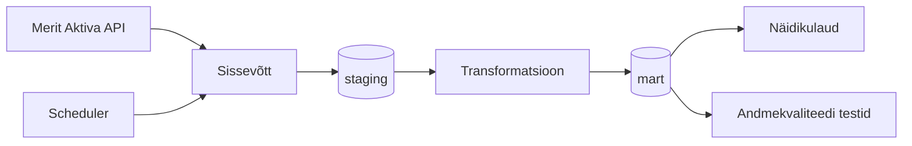

# Arhitektuur

## Äriküsimus

Ettevõtja juhtimislaud, mis võimaldab jälgida ettevõtte finantsseisu reaalajas ning võrrelda seda konkurentidega.

## Mõõdikud

1. Vaba raha - pangakontode saldod + kassa - tasumist vajavad arved
2. Viimase 30 päeva tulud ja kulud
3. Rahaline puhver (Runway) - vaba raha / keskmine kulu päeva kohta
4. Käibemaksu kuupõhine arvestus - müügikäibemaks - sisendkäibemaks = tasumisele kuuluv summa
5. Viimased tehingud - 5 viimast tehingut
6. Konkurentide võrdlustabel - käive, kasum, töötajad, käive €/töötajate arv, MTA võlg

## Andmeallikad

| Allikas | Tüüp | Ajas muutuv? | Roll |
|---------|------|--------------|------|
| [Nimi] | [API / CSV / DB] | Jah, [iga X tundi / päeva] | [Milleks kasutatakse?] |
| [Nimi] | [seed / dim-tabel] | Ei, staatiline | [Milleks kasutatakse?] |

## Andmevoog

flowchart TD
    subgraph SRC["Andmeallikad"]
        MA["Merit Aktiva API"]
        EMTA_MK["EMTA Maksulaekumine\navaandmed"]
        EMTA_MV["EMTA Maksuvõlglaste\nnimekiri CSV"]
    end

    subgraph INGEST["Sissevõtt"]
        IN_MA["HTTP REST päring"]
        IN_MK["HTTP allalaadimine"]
        IN_MV["CSV allalaadimine"]
    end

    subgraph STAGING["PostgreSQL · staging — töötlemata andmed"]
        S1["stg_merit_pangakontod"]
        S2["stg_merit_kassa"]
        S3["stg_merit_myygiarved"]
        S4["stg_merit_ostuarved"]
        S5["stg_merit_tehingud"]
        S6["stg_emta_maksulaekumine"]
        S7["stg_emta_maksuvolglased"]
    end

    subgraph MART["PostgreSQL · mart — äriloogika ja mõõdikud"]
        M1["mart_vaba_raha\nsaldo + kassa − tasumata arved"]
        M2["mart_tulud_kulud_30p\nviimase 30p tulu ja kulu"]
        M3["mart_runway\nvaba raha ÷ kulu/päev"]
        M4["mart_kaibemaks\nmüügikm − sisendkm"]
        M5["mart_viimased_tehingud\n5 viimast tehingut"]
        M6["mart_konkurendid\nkäive · kasum · töötajad · võlg"]
    end

    QA["Andmekvaliteedi testid"]

    subgraph DASH["Ettevõtja juhtimislaud"]
        D1["Vaba raha"]
        D2["Tulud ja kulud 30p"]
        D3["Runway"]
        D4["KM arvestus"]
        D5["Viimased tehingud"]
        D6["Konkurentide vordlus"]
    end

    MA --> IN_MA
    EMTA_MK --> IN_MK
    EMTA_MV --> IN_MV

    IN_MA --> S1
    IN_MA --> S2
    IN_MA --> S3
    IN_MA --> S4
    IN_MA --> S5
    IN_MK --> S6
    IN_MV --> S7

    S1 --> M1
    S2 --> M1
    S4 --> M1
    S3 --> M2
    S4 --> M2
    M1 --> M3
    M2 --> M3
    S3 --> M4
    S4 --> M4
    S5 --> M5
    S6 --> M6
    S7 --> M6

    MART --> QA

    M1 --> D1
    M2 --> D2
    M3 --> D3
    M4 --> D4
    M5 --> D5
    M6 --> D6

## Andmebaasi kihid

| Kiht | Roll |
|------|------|
| `staging` | Hoiab allika andmeid töötlemata kujul. |
| `mart` | Hoiab transformeeritud ja ärilogikat sisaldavaid tabeleid. |

## Tööjaotus

| Roll | Vastutus | Täitja |
|------|----------|--------|
| Andmeallika omanik | Kirjutab sissevõtu loogika, hoiab API-t töös | Veli |
| Transformatsioonide omanik | Kirjutab mart kihi mudelid ja mõõdikute arvutuse | Steven |
| Kvaliteedi omanik | Kirjutab testid ja vaatab läbi ebaõnnestunud kontrollid | Karin |
| Näidikulaua omanik | Ehitab näidikulaua ja seob selle äriküsimusega | Kristel |

## Riskid

| Risk | Mõju | Maandus |
|------|------|---------|
| [Risk 1 — näiteks: API ei vasta] | [Mis juhtub?] | [Kuidas maandad?] |
| [Risk 2] | [Mis juhtub?] | [Kuidas maandad?] |
| [Risk 3] | [Mis juhtub?] | [Kuidas maandad?] |

## Privaatsus ja turve

[Kirjelda, millised isiku- või tundlikud andmed teie projektis esinevad (kui üldse) ja kuidas neid kaitsete. Isikuandmed peavad olema anonümiseeritud. Andmebaasi paroolid peavad tulema `.env` failist.]
