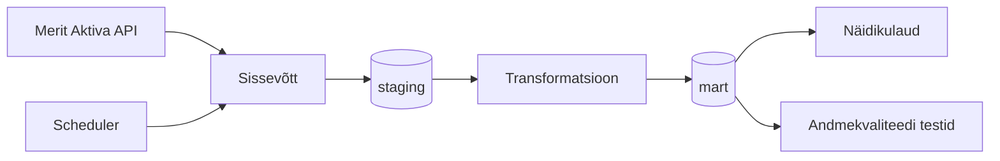

# Arhitektuur

## Äriküsimus

Ettevõtja juhtimislaud, mis võimaldab jälgida ettevõtte finantsseisu reaalajas ning võrrelda seda konkurentidega.

## Mõõdikud

1. Vaba raha - pangakontode saldod + kassa - tasumist vajavad arved
2. Viimase 30 päeva tulud ja kulud
3. Rahaline puhver (Runway) - vaba raha / keskmine kulu päeva kohta
4. Käibemaksu kuupõhine arvestus - müügikäibemaks - sisendkäibemaks = tasumisele kuulub
5. Viimased tehingud - 5 viimast tehingut
6. Konkurentide võrdlustabel - käive, kasum, töötajad, käive €/töötajate arv, MTA võlg

## Andmeallikad

| Allikas | Tüüp | Ajas muutuv? | Roll |
|---------|------|--------------|------|
| [Nimi] | [API / CSV / DB] | Jah, [iga X tundi / päeva] | [Milleks kasutatakse?] |
| [Nimi] | [seed / dim-tabel] | Ei, staatiline | [Milleks kasutatakse?] |

## Andmevoog

## Andmebaasi kihid

| Kiht | Roll |
|------|------|
| `staging` | Hoiab allika andmeid töötlemata kujul. |
| `mart` | Hoiab transformeeritud ja ärilogikat sisaldavaid tabeleid. |

## Tööjaotus

| Roll | Vastutus | Täitja |
|------|----------|--------|
| Andmeallika omanik | Kirjutab sissevõtu loogika, hoiab API-t töös | Veli |
| Transformatsioonide omanik | Kirjutab mart kihi mudelid ja mõõdikute arvutuse | Steven |
| Kvaliteedi omanik | Kirjutab testid ja vaatab läbi ebaõnnestunud kontrollid | Karin |
| Näidikulaua omanik | Ehitab näidikulaua ja seob selle äriküsimusega | Kristel |

## Riskid

| Risk | Mõju | Maandus |
|------|------|---------|
| [Risk 1 — näiteks: API ei vasta] | [Mis juhtub?] | [Kuidas maandad?] |
| [Risk 2] | [Mis juhtub?] | [Kuidas maandad?] |
| [Risk 3] | [Mis juhtub?] | [Kuidas maandad?] |

## Privaatsus ja turve

[Kirjelda, millised isiku- või tundlikud andmed teie projektis esinevad (kui üldse) ja kuidas neid kaitsete. Isikuandmed peavad olema anonümiseeritud. Andmebaasi paroolid peavad tulema `.env` failist.]
